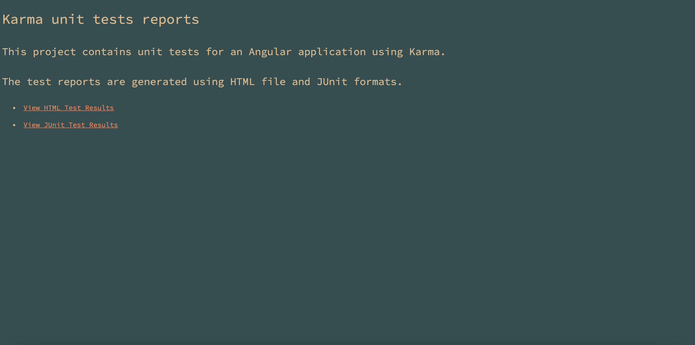
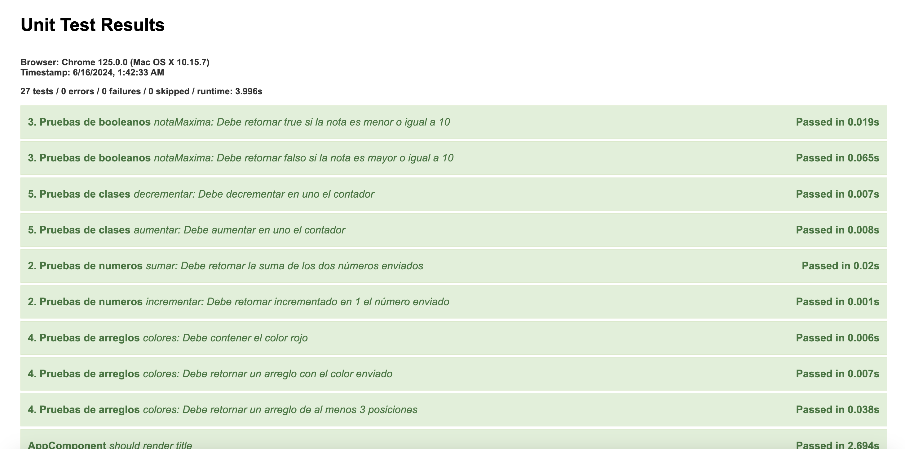
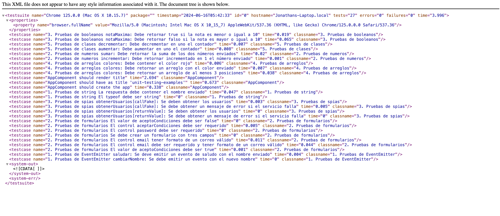

# WORKSHOP

<table>
  <tr>
    <td></td>
    <td></td>
    <td></td>
  </tr>
</table>

## Unit testing con Angular: Introducción y Primeros pasos

### **Prerequisitos**

Este workshop está dirigido a desarrolladores de software con un entendimiento básico de Typescript, no es necesario conocer a profundidad el framework Angular, sin embargo es aconsejable tener un conocimiento básico del mismo.

Conoceremos los conceptos básicos para trabajar el Unit Testing en Angular, y trabajaremos en la creación de pruebas unitarias desde el nivel más básico hasta crear ejemplos de complejidad media.

### [**Herramientas Necesarias**](0-configuraciones-necesarias/0-configuraciones-necesarias.md)

Para seguir este workshop, asegúrate de tener instalados los siguientes programas:

- NodeJS
- Angular
- Visual Studio Code
- Visual Studio Code Extensions
- Git

### [**Empecemos**]() 🚀

Antes de comenzar con la implementación práctica, es crucial entender algunos conceptos fundamentales que formarán la base de nuestro trabajo. En las siguientes secciones, exploraremos qué son las pruebas automáticas, sus tipos, y los beneficios de las pruebas unitarias. Luego, profundizaremos en Jasmine y Karma, las herramientas principales que utilizaremos para escribir y ejecutar nuestras pruebas en Angular.

### [**Pruebas automáticas**](1-pruebas-automaticas/1-1-pruebas-automaticas.md)

- [쯈ué son las pruebas automáticas?](1-pruebas-automaticas/1-1-pruebas-automaticas.md)
- [Tipos de pruebas automáticas](1-pruebas-automaticas/1-2-tipos-pruebas-automaticas.md)
- [쯈ué debo probar?](1-pruebas-automaticas/1-3-que-debo-probar.md)
- [쮺uales son sus beneficios?](1-pruebas-automaticas/1-4-ventajas-pruebas-unitarias.md)

### [**Pruebas Unitarias**](2-pruebas-unitarias/2-1-ventajas-pruebas-unitarias.md)

- [Ventajas](2-pruebas-unitarias/2-1-ventajas-pruebas-unitarias.md)
- [Desventajas](2-pruebas-unitarias/2-2-desventajas-pruebas-unitarias.md)

### [**Jasmine**](3-jasmine/3-1-sobre-jasmine.md)

- [Sobre Jasmine](3-jasmine/3-1-sobre-jasmine.md)

### [**karma**](4-karma/4-1-sobre-karma.md)

- [Sobre Karma](4-karma/4-1-sobre-karma.md)

### [**Empecemos**](5-empecemos/empecemos.md)

- [Empecemos](5-empecemos/empecemos.md)

### **Demostración**

Aquí hay algunas capturas de pantalla de la aplicación:

## License 

The MIT License (MIT)

- **Copyright (c) 2024 Jonathan Reátegui**

Permission is hereby granted, free of charge, to any person obtaining a copy of this software and associated documentation files (the "Software"), to deal in the Software without restriction, including without limitation the rights to use, copy, modify, merge, publish, distribute, sublicense, and/or sell copies of the Software, and to permit persons to whom the Software is furnished to do so, subject to the following conditions:

The above copyright notice and this permission notice shall be included in all copies or substantial portions of the Software.

THE SOFTWARE IS PROVIDED "AS IS", WITHOUT WARRANTY OF ANY KIND, EXPRESS OR IMPLIED, INCLUDING BUT NOT LIMITED TO THE WARRANTIES OF MERCHANTABILITY, FITNESS FOR A PARTICULAR PURPOSE AND NONINFRINGEMENT. IN NO EVENT SHALL THE AUTHORS OR COPYRIGHT HOLDERS BE LIABLE FOR ANY CLAIM, DAMAGES OR OTHER LIABILITY, WHETHER IN AN ACTION OF CONTRACT, TORT OR OTHERWISE, ARISING FROM, OUT OF OR IN CONNECTION WITH THE SOFTWARE OR THE USE OR OTHER DEALINGS IN THE SOFTWARE.
